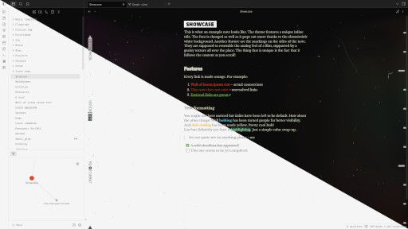
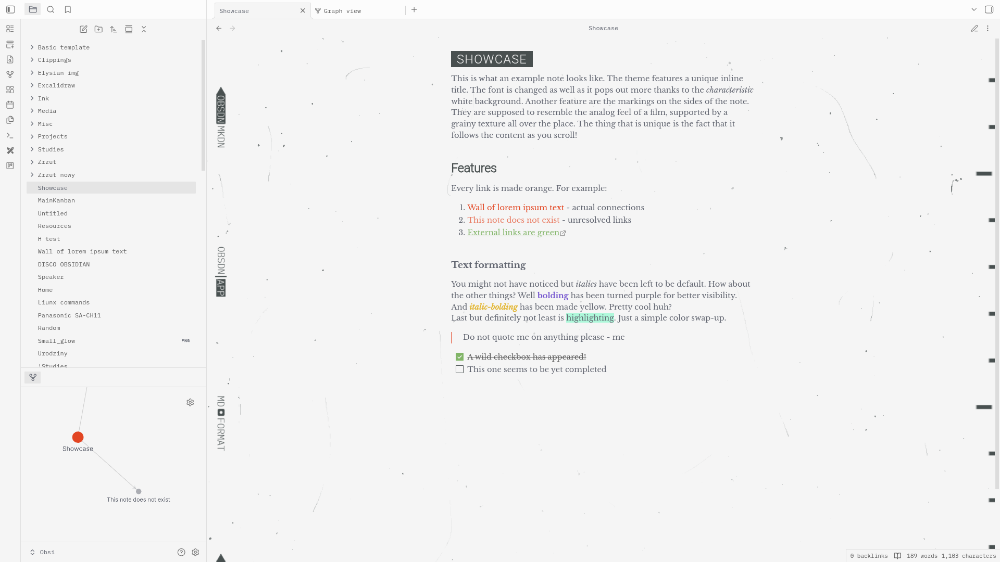
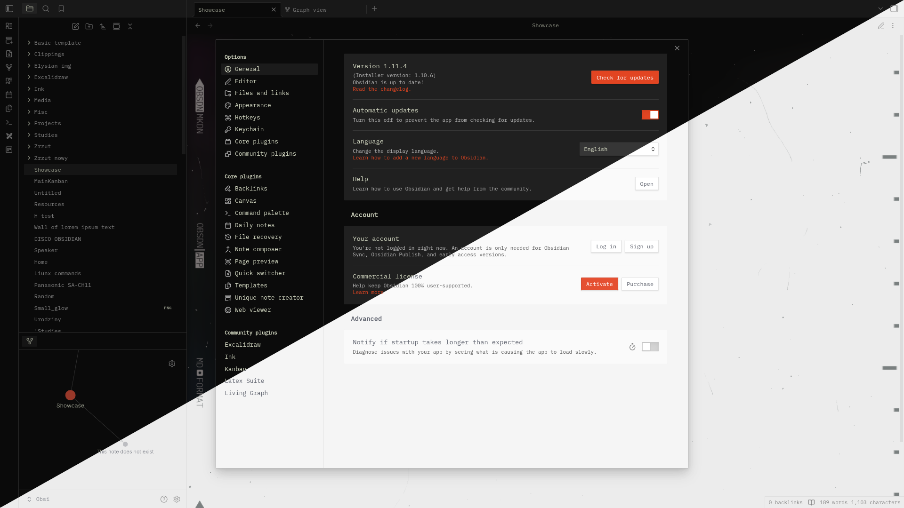

# Elysian
This is a minimalistic [Obsidian](https://obsidian.md/) theme inspired by the UI of [Disco Elysium](https://discoelysium.com/). It has custom embedded backgrounds, fonts and features film-like markings and grainy texture that follows the content. It supports both dark and light color scheme. 

# Gallery

# Notes
- This is my first theme and to be fair any kind of CSS work. I don't guarantee full functionality so please let me know if anything is broken or incompatible.
- It works best with readable line width turned on (it keeps the aesthetic the most), but the support for full line width is implemented

# Features
- Fully working light theme that has it's own identity
- The texture background follows the content as you scroll
- Some text formatting syntax features colors (bolding and bold-italic)
- The inline title has a stylish background that makes it stand out
- Headers h1, h2 , h3 have a different font (same as inline title)
- Internal and external links are different colors
- Terminal-looking UI font
- Light theme has darkening of selected line

# Plugins
Due to it's unsual feature of the background scrolling with the content, it may be buggy with some plugins. In my limited testing it works alright but if you find any problems do let me know.

# Credits
Inspiration and some bits of code were taken from:
- [Obsidian Nord](https://github.com/insanum/obsidian_nord) - gave me insight into many CSS variables
- [Nier](https://github.com/exloseur3d/nier-theme) - image and background handling
- [Typewriter](https://github.com/crashmoney/obsidian-typewriter) - importing of fonts 
- [This](https://forum.obsidian.md/t/trying-to-create-a-background-that-repeats-and-scrolls/90752) - thread on making scroll-able background

# Fonts
Fonts themselves have been embedded in base64 which should provide seamless usage. All fonts used under the Open Font License ([OFL](https://openfontlicense.org)). 
- [Libre Baskerville](https://fonts.google.com/specimen/Libre+Baskerville)
- [IBM Mono Plex](https://github.com/IBM/plex?tab=readme-ov-file)
- [Encoded Sans Black](https://fonts.google.com/specimen/Encode+Sans+Condensed)
- [Roboto Light](https://fonts.google.com/specimen/Roboto)

# Legal disclaimer
I am not affiliated with ZA/UM. I am not using any material that is their property, this is simply an unofficial fan project.
