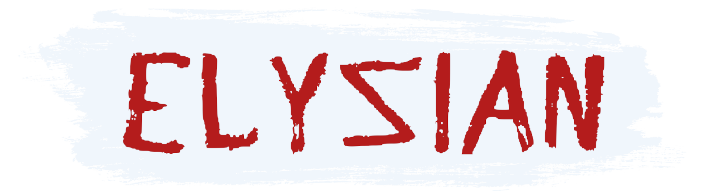
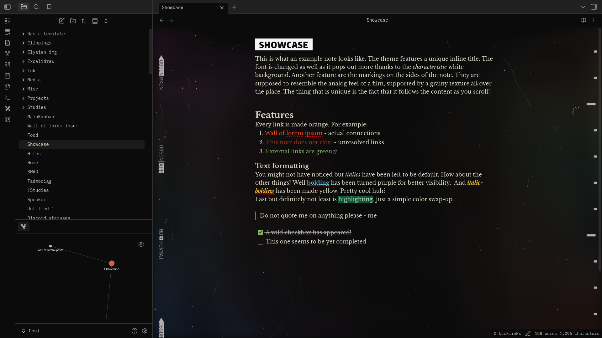
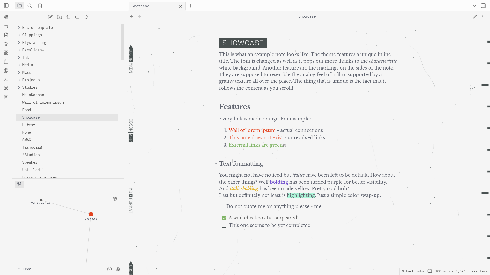
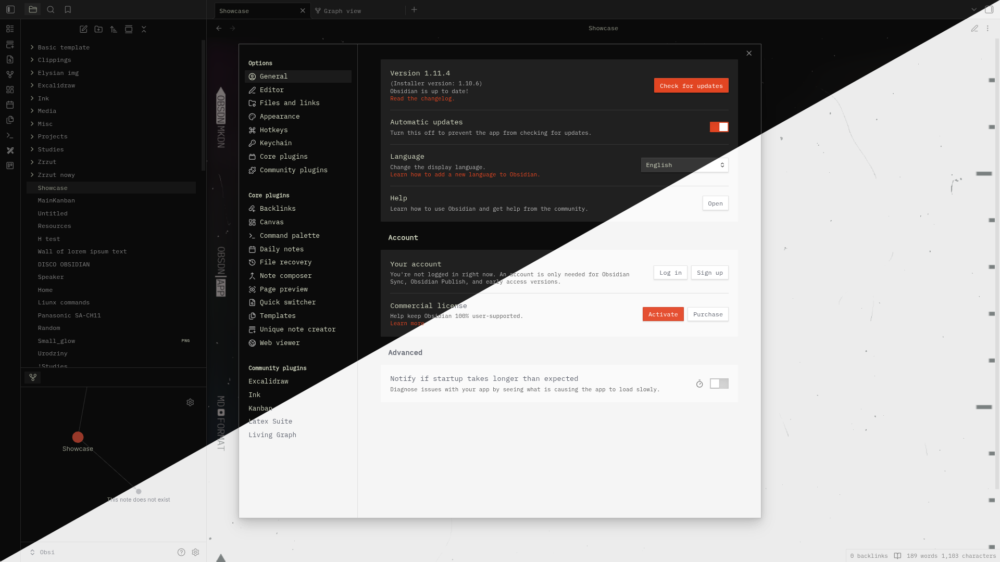

# Elysian
This is a simple [Obsidian](https://obsidian.md/) theme inspired by the UI of [Disco Elysium](https://discoelysium.com/). It has film-like markings, and a grainy texture that gives an impression of a rolling film as you scroll. Custom inline-titles, colorful text formatting and a classic UI font. Supports both light and dark theme.

# Gallery

# Notes
- This is my first theme and to be fair any kind of CSS work. I don't guarantee full functionality so please let me know if anything is broken or incompatible.
- It works best with readable line width turned on, but the support for full line width is implemented.
- Mobile is functional but not finalised. 

# Features
- The texture background follows the content as you scroll
- Bold formatting features colors 
- The inline title has a custom look
- Internal and external links are different colors
- Terminal-looking UI font
- Fully working light theme
- Light theme has darkening of selected line

# Future plans
- Add HTML markers for marking colored text (DE skills)
- Further improve mobile look
- Add support for style settings

# Plugins
Due to its feature of the background scrolling and inline titles, it may be buggy with some plugins. In my limited testing it works alright, but if you find any problems do let me know.

# Credits
Inspiration and some bits of code were taken from:
- [Obsidian Nord](https://github.com/insanum/obsidian_nord) - gave me insight into many CSS variables
- [Nier](https://github.com/exloseur3d/nier-theme) - image and background handling
- [Typewriter](https://github.com/crashmoney/obsidian-typewriter) - importing of fonts 
- [This](https://forum.obsidian.md/t/trying-to-create-a-background-that-repeats-and-scrolls/90752) thread on making scrollable background

# Fonts
Fonts themselves have been embedded in base64 which should provide seamless usage. All fonts used under the Open Font License ([OFL](https://openfontlicense.org)). 
- [Libre Baskerville](https://fonts.google.com/specimen/Libre+Baskerville)
- [IBM Mono Plex](https://github.com/IBM/plex?tab=readme-ov-file)
- [Encoded Sans Black](https://fonts.google.com/specimen/Encode+Sans+Condensed)
- [Roboto Light](https://fonts.google.com/specimen/Roboto)

# Legal disclaimer
I am not affiliated with ZA/UM. I am not using any material that is their property, this is simply an unofficial fan project.

# Changelog
#### 1.2.0
- Improvements to background handling
- The side markers are now SVGs
- Fixed bugs caused by previous implementation of the background
- First set of improvements for mobile (properties now don't overlap onto the markers, color fixes, less rounded navbar, proper sizing)
- Pretty properties fix for inline icons
